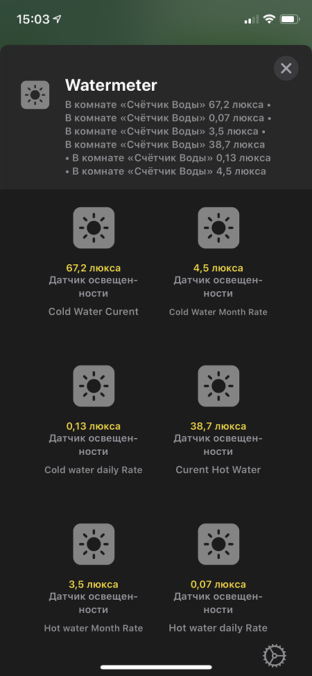

# wc_esp8266

ESP8266, LiquidCrystal_I2C watermeter monitor with MQTT

----------

Здесь лежит скетч для Arduino IDE, с помощью которого из ESP8266 и двухстрокового LCD 16x2 можно сделать монитор для счетчиков воды.
Возможности:
1. Установка первоначальных значений через MQTT
2. Все измерения сохраняются  EEPROM.
3. Сделана поддержка обновления прошивки по Wi-Fi

### Внимание
гарантированная работоспособность проверена Bounce 2 ver 2.2.0
----------
### History

#### 1.0.4 - 2020.04.17 - Оптимизация задержки в процедурах. 

#### 1.0.3 - 2020.03.31 - BugFix, Вынос WiFi, MQTT, Update Server во внешние процедуры.

#### 1.0.2 - 2020.03.28 - BugFix, Вынос настроек в Settings.h (GitHub)

#### 1.0.1 - 2020.03.25 - Первая версия кода на базе ESP8266
----------

### HOW USE

### Перед сборкой измените параметры в `Settings.h`

    //Hostname of ESP8266
    #define WIFI_HOSTNAME "WaterMeter"

    //Wifi SSID to connect to Leave empty to disable Wi-Fi.
    #define WIFI_SSID "Bestoloch"

    //Passowrd for WIFI
    #define WIFI_PASSWORD "511794sinikon"

    //set the mqqt host name or ip address to your mqqt host. Leave empty to disable mqtt.
    #define MQTT_SERVER "10.10.100.14"
    //mqtt port for the above host
    #define MQTT_PORT  1883
    //if authentication is enabled for mqtt, set the username below. Leave empty to disable authentication
    #define MQTT_USER "orangepi"
    #define MQTT_PASS "orangepi"

    // Publish branch of topic to MQTT
    #define PUB_TOPIC  "/home/watermeter/"
    // Subscribe  branch of topic for Callback
    #define SUB_TOPIC  "/home/watermeter/correct/#"

/////////////////////////webupdate server//////////////////////////////////////////

    #define update_host  "WaterMeter"

    #define update_path  "/firmware"

    #define update_username  "admin"

    #define update_password  "admin"

    /////////////////////////////////////////////////////////////////////////////////////////////////
    #define DEBUG true   // Выдача отладочной информации в COM-порт
    #define BUFFER_SIZE 100

    // Пины для подключения устройств
    #define BUTTON_PIN   16//Пин с кнопкой
    #define HOT_COUNTER_PIN  14//Пин счетчика горячей воды
    #define COLD_COUNTER_PIN 12//Пин счетчика холодной воды
    #define COUNTERS 2//Колличество счетчиков в системе
    #define STEP 10 // Цена импульса - 1 на 10 литров, или 1 на литр

## Установка превочальных значений
 Если необходимо скоректировать данные или установить первоначальные значения.:

 1. Записать в  MQTT Topic "/watercount/correct/reset" = 1
 2.  Записать в  MQTT Topic "/watercount/correct/Cold:{Hot:}"  = 00000,000 (после запятой обязательно 3 знака)

Когда данные будут сохранены в EEPROM

1. в MQTT Topic вернется  /watercount/correct/reset = 0
2. в MQTT Topic вернется /watercount/status "set Cold: new data"

## Iobroker MQTT Topic`s

## Вариант использования
Представление данных в Apple Homekit

## История
Началось все с статьи https://pikabu.ru/story/podklyuchaem_arduino_k_schetchikam_vodyi_4258720

Потом была экспериментальная реализация https://github.com/dfrozen/watercounter

## Похожие проекты
При реализации были доскональна изучены проекты:
 
1. https://github.com/dontsovcmc/waterius
2. https://github.com/bram2202/mqtt-watermeter

## License
MIT License

Copyright (c) 2020 Andrey Kuznetsoff

Permission is hereby granted, free of charge, to any person obtaining a copy of this software and associated documentation files (the "Software"), to deal in the Software without restriction, including without limitation the rights to use, copy, modify, merge, publish, distribute, sublicense, and/or sell copies of the Software, and to permit persons to whom the Software is furnished to do so, subject to the following conditions:

The above copyright notice and this permission notice shall be included in all copies or substantial portions of the Software.

THE SOFTWARE IS PROVIDED "AS IS", WITHOUT WARRANTY OF ANY KIND, EXPRESS OR IMPLIED, INCLUDING BUT NOT LIMITED TO THE WARRANTIES OF MERCHANTABILITY, FITNESS FOR A PARTICULAR PURPOSE AND NONINFRINGEMENT. IN NO EVENT SHALL THE AUTHORS OR COPYRIGHT HOLDERS BE LIABLE FOR ANY CLAIM, DAMAGES OR OTHER LIABILITY, WHETHER IN AN ACTION OF CONTRACT, TORT OR OTHERWISE, ARISING FROM, OUT OF OR IN CONNECTION WITH THE SOFTWARE OR THE USE OR OTHER DEALINGS IN THE SOFTWARE.
